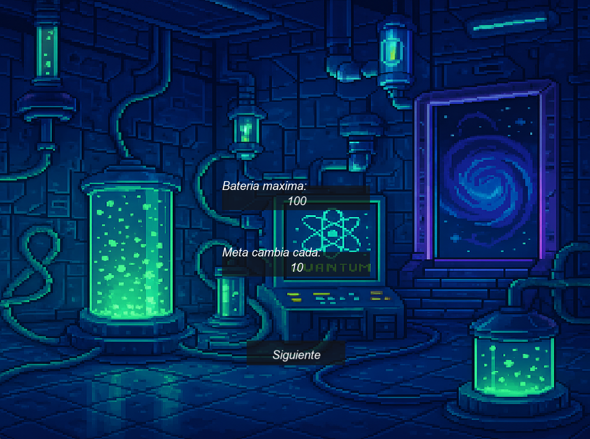

# juegosimu

# Escape the Grid – *Prisión Cuántica*

> **¡Encuentra la salida antes de que tu batería se agote y la prisión cambie bajo tus pies!**  
> Un puzzle game basado en pentágonos, con salida móvil y mutaciones aleatorias en cada turno.

---

 <!-- coloca aquí un banner 1280×720 -->

## Acerca de este juego
En *Escape the Grid – Prisión Cuántica* encarnas a un recluso atrapado en una prisión experimental donde  
cada **movimiento** altera la geometría del mapa. Las **celdas pentagonales** pueden aparecer o desaparecer,  
tu **batería** se drena con cada paso y la **salida** cambia de ubicación cada *N* turnos.  
¿Podrás planificar tu ruta o dejarás que el algoritmo BFS lo haga por ti?

### Mecánicas clave
| | |
|---|---|
| 🔺 **Mapa pentagonal** | Todas las casillas son pentágonos adyacentes. |
| 🔋 **Batería limitada** | El jugador dispone de `BATERIA_MAX` pasos. |
| 🔄 **Mutación del mapa** | 5 % de probabilidad de que una celda cambie de estado tras cada paso. |
| 🏁 **Salida móvil** | El punto de escape se reubica cada `META_CAMBIO_CADA` movimientos. |
| 🧠 **Algoritmo BFS** | Pulsa **R** para visualizar y recorrer automáticamente la ruta más corta. |
| 🖥️ **Solo teclado** | Control total mediante `W A S D` y atajos; sin ratón durante el juego. |

---

## Requisitos del sistema
| Mínimo | Recomendado |
|--------|-------------|
| **SO** Windows 10 (64 bit) o Linux (x64) | Windows 11 / Linux (x64) |
| **CPU** Intel i3 / Ryzen 3 | Intel i5 / Ryzen 5 |
| **RAM** 4 GB | 8 GB |
| **GPU** Cualquiera con OpenGL 3.0 | GPU dedicada con OpenGL 3.3 |
| **Almacenamiento** 150 MB libres | 150 MB libres |
| **Dependencias** SFML 2.6.2 · tinyfiledialogs | Ídem |

---

## Cómo compilar

### Windows (MSYS2 / MinGW-w64)

 ```bash 
git clone https://github.com/tu-usuario/EscapeTheGrid.git
cd EscapeTheGrid
g++ main.cpp tinyfiledialogs.c -o EscapeTheGrid.exe ^
   -I\"SFML-2.6.2/include\" -L\"SFML-2.6.2/lib\" ^
   -lsfml-graphics -lsfml-window -lsfml-system ^
   -lcomdlg32 -lole32


primero cargar : g++ main.cpp tinyfiledialogs.c -o game -I"C:\Users\HENMA\OneDrive\Escritorio\juego simu\SFML-2.6.2\include" -L"C:\Users\HENMA\OneDrive\Escritorio\juego simu\SFML-2.6.2\lib" -lsfml-graphics -lsfml-window -lsfml-system -lcomdlg32 -lole32

segundo: ./game

```


## Cómo jugar

1. **Ejecuta** el programa (`EscapeTheGrid.exe` / `./EscapeTheGrid`).
2. En el menú principal haz clic en **Jugar**.
3. Ajusta **Batería máxima** y **Meta cambia cada** en la pantalla de configuración.
4. Selecciona un mapa `.txt` (usa los ejemplos en `/levels` o crea los tuyos).
5. Si el mapa no lo incluye, da clic en dos celdas para colocar **jugador** y **meta**.
6. Muévete con `W A S D` o pulsa **R** para que el algoritmo BFS recorra el camino óptimo.
7. Llega a la meta antes de que la batería se agote… ¡o quedarás atrapado para siempre!

### Controles

| Tecla | Acción |
|-------|--------|
| **W** | Mover arriba |
| **S** | Mover abajo |
| **A** | Mover arriba-izq / abajo-izq (según la fila) |
| **D** | Mover arriba-der / abajo-der (según la fila) |
| **R** | Calcular ruta y activar movimiento automático |
| **Esc** | Cerrar ventana |

### Capturas de pantalla / GIFs

|  |  |
|---------------------------------------------|--------------------------------------------|

> Coloca tus imágenes en `docs/media` y actualiza los nombres si es necesario.

### Créditos y licencias

- **Código:** *Equipo Escape Q (2025)* – licencia MIT.  
- **SFML 2.6.2:** © 2007-2024 Laurent Gomila y colaboradores.  
- **tinyfiledialogs:** © Nicolas Guillemot – licencia zlib.  
- **Arte & sonidos:** creados por el equipo o con licencias CC-BY (ver `assets/attribution.txt`).
- **Programadores del Juego:** Henry Martinez, Carlos Ordoñez Jose Rodriguez.
